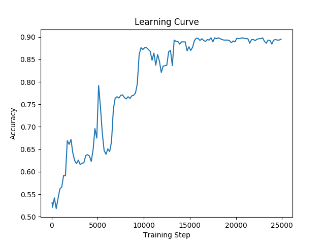
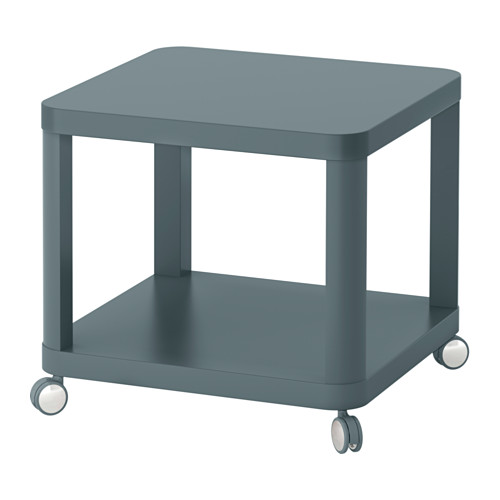
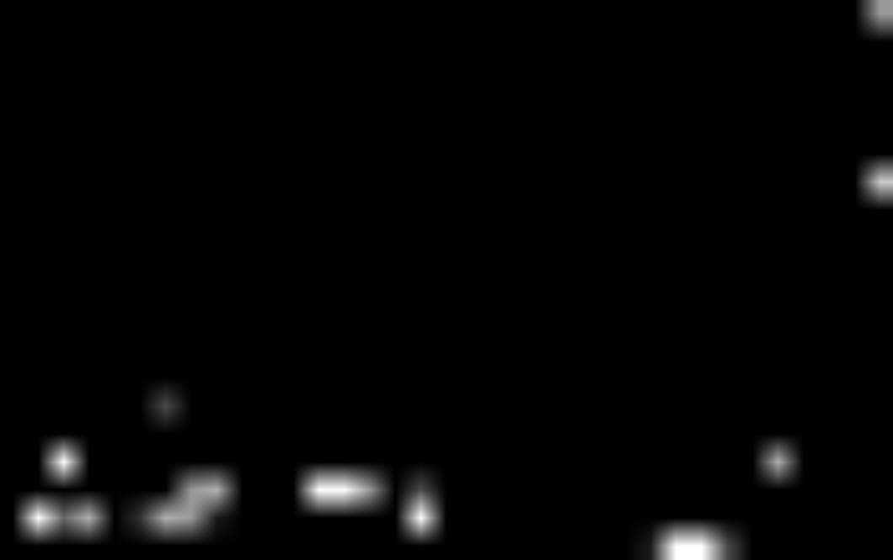
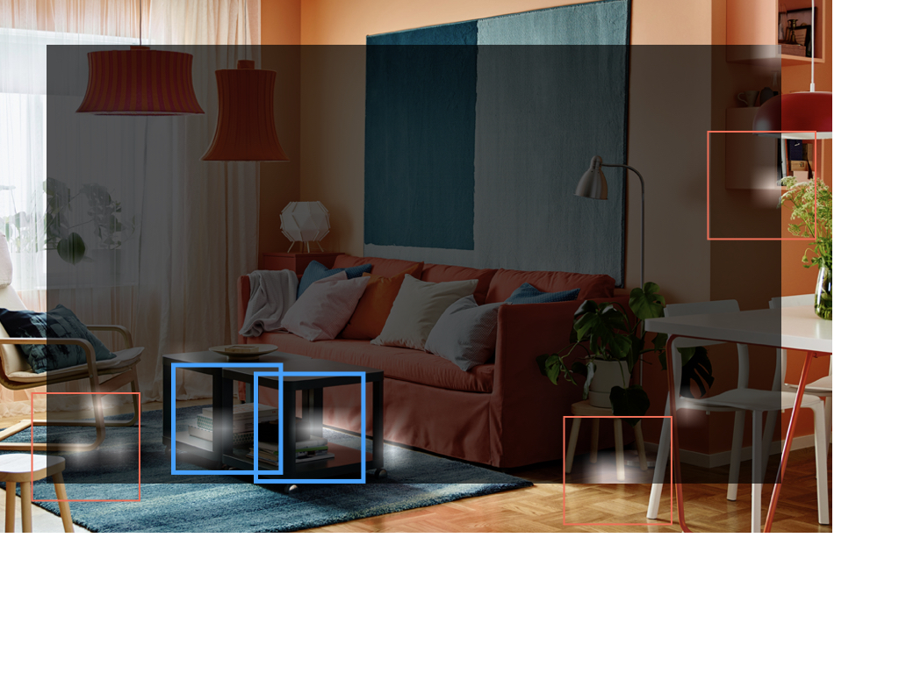

# ObjectRecognition

## Goal
The goal of this project is to recognize and locate objects, here, 
IKEA products, in images of indoor scenes from "IKEA galleries."
The pictures of the IKEA products and the indoor scenes are collected from
[Label Me](http://labelme2.csail.mit.edu/Release3.0/index.php).

## Method
### Overview
We build a detector which takes two images, the object and the scene,
and spit out a number between 0 and 1, indicating whether the object
exists in the scene.
In our implementation, the output are 2 numbers summing up to be 1.
So the first number can be interpreted as the probability of object in the 
scene.

Then we combine the detector with a sliding window.
The sliding window slides over the scene and feed the detector with the 
segmented image in the window.
The output of the detector is recorded in a matrix.
Thus when the sliding window goes over the entire scene, we can get a matrix
in which each cell represents the probability that the object exists at that
location.

We need to use different sizes of sliding windows because the object may have
different sizes. 
And we can only detect one images at a time because the detector needs both
the picture of the scene and the object.

### Detector
We use the [AlexNet](https://papers.nips.cc/paper/4824-imagenet-classification-with-deep-convolutional-neural-networks.pdf) 
as feature extractor.
The scene and object are feed into two identical pre-trained parallel AlexNet's
which produce two 4096-dimension feature vectors.
Then we concatenate these two vectors as one 8192-dimension vector and append
two hidden layers after that.
Each hidden layer contains 4096 units and they use ReLU as the activation 
function.
The output layer contains 2 nodes, as described above, and use SoftMax as 
activation function.

## Implementation
### Requirements
* Python 3
* TensorFlow >= 1.6
* Numpy
* cv2

### File Structure
The file structure is the following

```
.
|
+ bvlc_alexnet.npy
+ caffee_classes.py
+ *.py
+ .gitignore
+ scan_images/
| |
| + set-?/
| | |
| | + object.jpg
| | + scene.jpg
| | + countour-?.jpg
|
+ tmp
| |
| + first/
|
+ dataset
  |
  + bedroom/
  + kitchen/
  + livingroom/
  + bathroom/
    |
    + scene_?
      |
      + ?.JPG
      + scene_?.xls
      + scene.jpg
      + scene.xml
```
 
The ``bvlc_alexnet.npy`` and ``caffee_classes.py`` are files from
a pre-trained AlexNet which can be download at [here](http://www.cs.toronto.edu/%7Eguerzhoy/tf_alexnet/).

The ``scan_images/`` is the directory where you put the image 
 of the testing object and scene. 
The countour-?.jpg is the HeatMap generated from the algorithm.
The HeatMap represent the probability matrix in a graphical way.
The light spot in the HeatMap represents a high probability that
the object locates at that position.

The ``bedroom/``, ``kitchen/``, and ``bathroom/``, etc. are the 
folders containing the training data. 
``?.JPG`` is the image of objects and ``scene_?.jpg`` is the scene
which contains those objects.
The ``scene.xml`` is file generated from ``LabelMe`` which records
the location of the objects.

The trained weight is stored at ``tmp/``.
You can train different neural network and store their weights in
different directory such as ``tmp/first/`` or ``tmp/second/``.

### Training and Evaluation
To train the detector, run

```
python3 neuralNet.py
```

The trained record will be stored under the directory you specified
(for example ``tmp/first``).
Before training, a fixed 1000-data evaluation dataset 
``test_data.p`` is generated 
and the network will be periodically evaluated during training.

### Predict
After training, run

```
python3 find_object_in_scene.py
```

to draw the HeatMap of the given object and scene.

You need to specify which network to use by setting the 
``path_to_model`` in ``find_object_in_scene.py``.
For example
```
path_to_model = "./tmp/first"
```

Then the HeatMap's will be generated under ``set-?/`` named as
``contour-?.jpg``.
We use 4 different sizes of sliding windows so there will be 4
HeatMap's with small index indicating small sliding window.

## Performance
### Learning Rate
Here is the learning rate trained using the default parameters in our code.



### Detection Sample
The scene and the object we used for testing are



The HeatMap generated from our algorithm is


Locate the object in the original scene:

where the blue bounding boxes indicate correct location and red 
boxes are the false positive.

## Future Work
Our detector is sensitive to the size of sliding window.
If the sliding window captures the object properly, then the 
detector can usually it correctly. 
So we can use more sizes of sliding windows to make the segmented
scene more accurate. 

If you have any questions or comments regarding our project, 
please contact us!